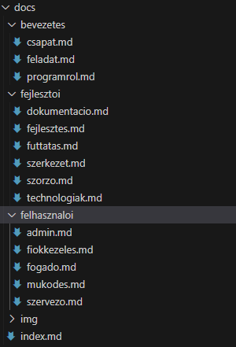
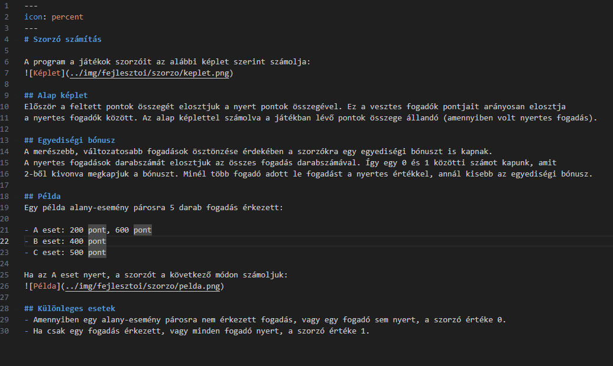
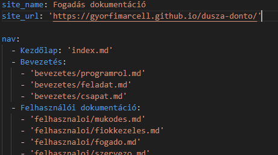
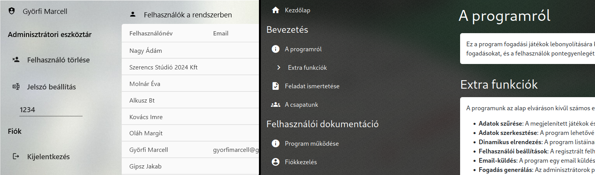
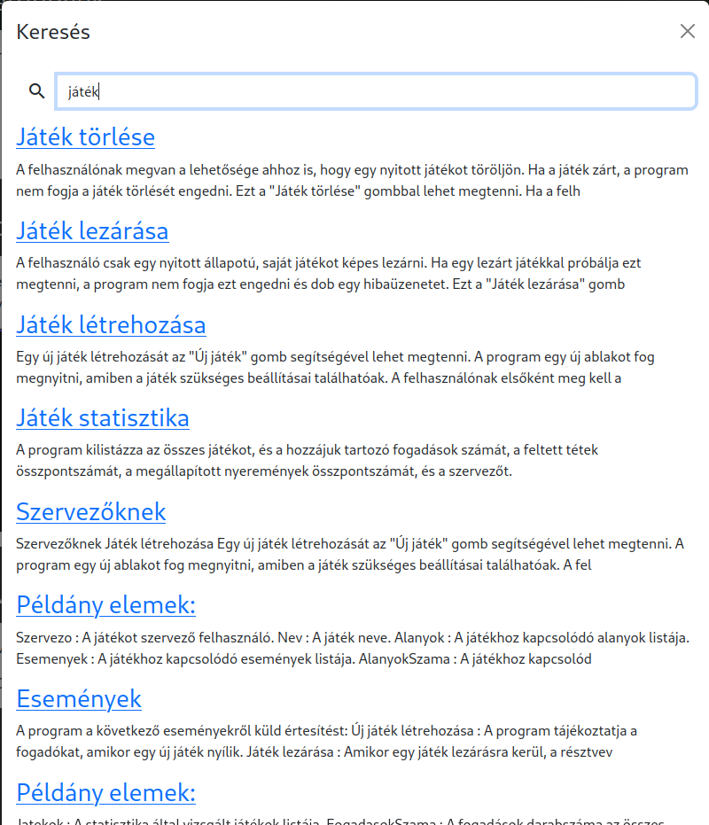
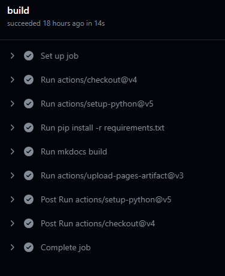

# Dokumentáció

A program dokumentációja egy statikus weboldal generáló program segítségével készült. A dokumentáció tartalmát Markdown 
formátumú fájlokban írtuk, amiből egy weboldal kerül elkészítésre. Ennek a rendszernek több előnye is van a hagyományos, 
PDF formátumú dokumentációkkal szemben. A szerkesztése egyszerűbb, az olvasónak pedig jobb felhasználói élményt nyújt.

## Tartalom szerkesztése
A dokumentáció szövege Markdown formátumú fájlokban íródott. Egy fájl egy oldalnak felel meg. Ez megkönnyíti a dokumentáció 
részegységekre tagolását, és a párhuzamos munkát.

A Markdown egyszerű szöveges fájlok formázását teszi lehetővé. Fejléceket és listákat hozhatunk létre, vagy képeket illeszthetünk 
be anélkül, hogy a dokumentum elrendezésével kéne foglalkoznunk. Egy másik előnye, hogy könnyen használható verziókezelő 
rendszerekben. Ennek köszönhetően nyomon követhetjük, hogy mikor mi változott.

## Weboldal generálása
A Markdown fájlok HTML oldallá alakítását az MkDocs nevű program végzi. Ez egy nyílt forráskódú, statikus weboldal-generátor, ami
kifejezetten dokumentációk készítésére lett kifejlesztve. A konfigurációs fájlban megadott fájlok tartalmát HTML kóddá alakítja, 
és elhelyezi egy sablonfájlba.

### Egyedi téma
Az MkDocs több témát is támogat. Mi egy saját fejlesztésű témát használunk. Ennek köszönhetően egységes lehet a program és a dokumentáció 
megjelenése. A megjelenés alapját a Bootstrap keretrendszer adja, amit egyedi CSS-el módosítunk. A weboldal reszponzív, a navigációt és 
tartalomjegyzéket tartalmazó oldalsáv mobilon kinyithatóvá válik.

### Keresés

A weboldal egyik előnye, hogy elhelyezhető rajta egy intelligens kereső. A Lunr.js Javascript könyvtár indexeli a generált 
HTML oldalakat, és feltérképezi a különböző alegységeket. Ezután a keresődoboz képes megtalálni cím, és tartalom alapján is. 
A keresés nem veszi figyelembe a kötőszavakat, és bizonyos szavakat különböző ragozással is megtalál.

## Weboldal közzététele
Amikor a Git repó `main` branch-ében módosul a dokumentáció egy fájlja, egy GitHub Action segítségével a weboldal automatikusan 
legenerálásra kerül. Ez a folyamat letölti a repó tartalmát és a szükséges csomagokat, legenerálja a weboldalt, majd feltölti a kész
tömörített állományt.

Egy másik folyamat feltölti a tömörített állományt a repó GitHub Pages oldalára. Ez egy ingyenes szolgáltatás, ami statikus weboldalak 
elérhetővé tételét teszi lehetővé. A szolgáltatás automatikusan biztosítja az oldal biztonságos, HTTPS-en keresztüli elérését.