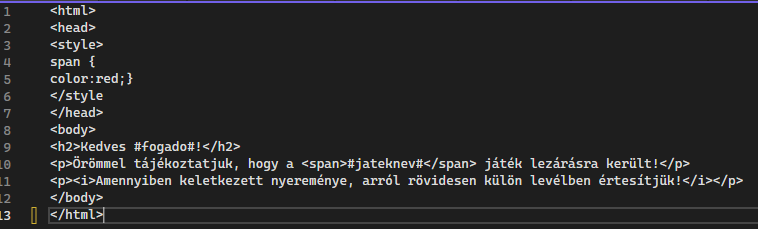

# Email küldés
A program bizonyos eseményekről email értesítést küld. A levelek küldéséért az `EmailKezelo` osztály felel. Ez az osztály 
betölti a sablonokat, majd egy SMTP szerveren keresztül elküldi a leveleket. A program egy beépített Gmail fiókot használ.

## Események
A program a következő eseményekről küld értesítést:

- **Új játék létrehozása**: A program tájékoztatja a fogadókat, amikor egy új játék nyílik.
- **Játék lezárása**: Amikor egy játék lezárásra kerül, a résztvevő fogadók értesítést kapnak.
- **Nyeremény**: Egy játék lezárásakor a nyertes fogadók külön emailt kapnak.
- **Jelszó módosítása**: A felhasználók értesítést kapnak, ha a jelszavuk megváltozik.

## Sablonok
Az emailekhez használt sablonok `txt` fájlokban találhatóak. Ezek a fájlok egy html-el elkészített szerkezetet tartalmaznak.
A `#` jel közé írt mezőket a program küldéskor helyettesíti az érintett felhasználó adataival.

## Továbbfejlesztés
Terveinkben szerepel az email szerepköreinek beállítása. Ennek a felülete már megtalálható az adminisztrátor ablakában, 
de ez még nem került megvalósításra.

