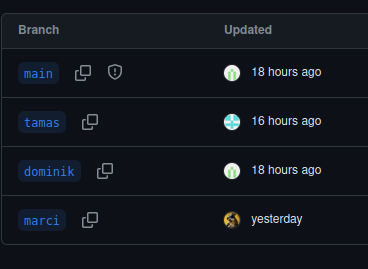
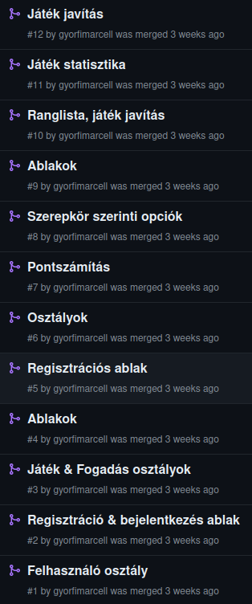
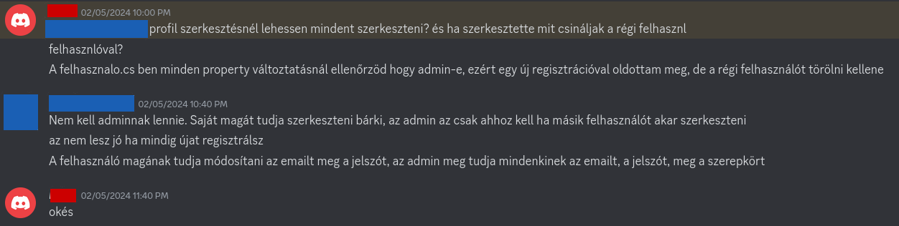

# Fejlesztés menete

## Verziókezelés
A verziókezeléshez Git-et használunk. A Github repónkban több branch-et hoztunk létre. Mindhárom csapattag egy saját branch-el
rendelkezik. A fejlesztés főként itt történik. Egy adott funkció elkészülése után egy pull request használatával átkerül a kód
a `main` branch-be.

Ez a folyamat biztosítja, hogy a `main` branch mindig egy futtatható, súlyos hiba nélküli verziót tartalmaz. A pull request-ek
használata lehetőséget ad ellenőrizni egymás munkáját, és konfliktus esetén megkönnyíti a hiba elhárítását.

## Kommunikáció
A munka közbeni kommunikáció személyesen, valamint Discord-on keresztül történt. Rendszeresen tartottunk hanghívásos megbeszéléseket, 
ahol átnéztük a projekt aktuális állapotát, egyeztettük a további feladatokat, és döntést hoztunk a felmerülő kérdésekben.
Ezen kívül folyamatosan elérhetőek voltunk megválaszolni egymás kérdéseit.

