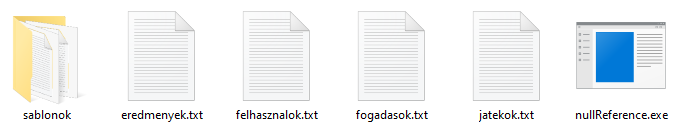

# Program futtatása
## Rendszerkövetelmények
- Windows 10 vagy újabb
- 1920x1080 vagy nagyobb felbontás

Fejlesztői környezet:

- Visual Studio 2022 vagy újabb
- DotNet 7.0 vagy újabb 

## Program indítása
A program a `nullReference.exe` fájl megnyitásával futtatható.

A programhoz mellékeltünk alapértelmezett adatokat. Amennyiben nem kívánja ezeket használni, törölje a `eredmenyek.txt`, 
`felhasznalok.txt`, `fogadasok.txt`, és `jatekok.txt` fájlokat.

A `sablonok` mappában megtalálhatóak az emailek sablonjai, amelyek könnyedén testreszabhatóak. Erről további információ 
található az [Email küldés](email.md) oldalon.