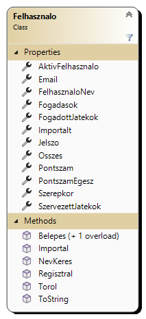
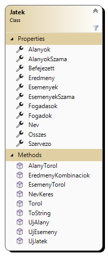
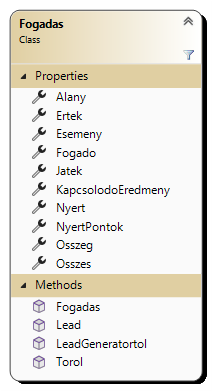
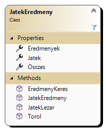
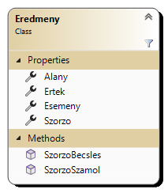
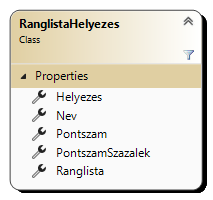
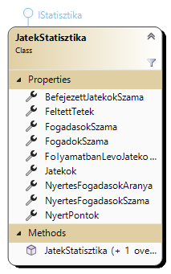
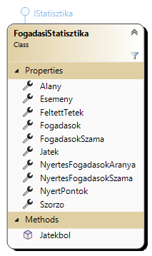
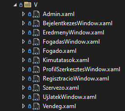

# Program szerkezeti felépítése

## Adatszerkezetek
A program fő adatszerkezetei egy-egy C# osztálynak felelnek meg. Ezek az osztályok két részre oszthatóak:

1. Statikus (azaz osztályszintű) elemek, amik az állományok kezeléséért felelnek.
2. Példány szintű elemek, amik egy darab objektumért felelnek.

Az osztályok létrehozása és módosítása property-ken és metódusokon keresztül történik. Ez lehetővé teszi a hibás adatok 
ellenőrzését, és biztosítja, hogy a fájlok tartalma szinkronban maradjon a program objektumaival.

### Felhasználók (`Felhasznalo.cs`)
Ebben a fájlban található a `Felhasznalo` osztály, ami a felhasználói fiókokat kezeli. Szintén ebben a fájlban található a 
`Szerepkor` Enum, és a `JogosultsagException` osztály is.



#### Statikus elemek:
- `AktivFelhasznalo`: A jelenleg bejelentkezett felhasználó. Alapértelmezetten egy új Vendég felhasználó.
- `Osszes`: Az összes regisztrált felhasználó.
- `NevKeres(string felhasznaloNev)`: Visszaadja az adott nevű felhasználót. Amennyiben nem találja, null-t ad vissza.
- `Belepes()`: Bejelentkezés egy Vendég felhasználóként.
- `Belepes(string felhasznaloNev, string Jelszo)`: Bejelentkezés egy regisztrált felhasználóként.
- `Regisztral(string felhasznaloNev, string email, string jelszo)`: Új felhasználó regisztrálása.
- `Importal(string felhasznaloNev, Szerepkor szerepkor)`: Létrehoz egy adott nevű felhasználót. Ebbe a fiókba nem lehet belépni, amíg a jelszava nincs megváltoztatva.

#### Példány elemek:
- `FelhasznaloNev`: A felhasználó neve. Egyedi azonosító.
- `Email`: A felhasználó email címe.
- `Jelszo`: A felhasználó jelszava.
- `Szerepkor`: A felhasználó szerepköre.
- `Importalt`: Fogadások vagy játékok fájlból importált-e a felhasználó.
- `SzervezettJatekok`: A felhasználó által szervezett játékok.
- `FogadottJatekok`: Játékok, amikben a felhasználó fogadást adott le.
- `Fogadasok`: A felhasználó által leadott fogadások.
- `Pontszam`: A felhasználó pontszáma. Ha a felhasználó nem fogadó, az értéke -1.
- `PontszamEgesz`: A felhasználó pontszáma, egészre kerekítve.
- `Torol`: Az adott felhasználó, és az általa létrehozott játékok és fogadások törlése.

#### Txt fájl szerkezete
```Gergely Bálint;gergely@example.com;1234;2;False```

A `felhasznalok.txt` a következő mezőket tartalmazza:

- Felhasználó neve
- Felhasználó email címe
- Felhasználó jelszava
- Felhasználó szerepköre (1 - Fogadó, 2 - Szervező, 3 - Adminisztrátor)
- Felhasználó importált-e (Fogadások vagy játékok fájlból importált-e a felhasználó.)


### Játékok (`Jatek.cs`)
Ebben a fájlban található a `Jatek` osztály, ami a játékokat, és a hozzájuk tartozó alanyokat és eseményeket kezeli.



#### Statikus elemek:
- `Osszes`: Az összes regisztrált játék.
- `NevKeres(string jatekNeve)`: Visszaadja az adott nevű játékot. Amennyiben nem találja, null-t ad vissza.
- `UjJatek(string jatekNeve)`: Új játék létrehozása.

#### Példány elemek:
- `Szervezo`: A játékot szervező felhasználó.
- `Nev`: A játék neve.
- `Alanyok`: A játékhoz kapcsolódó alanyok listája.
- `Esemenyek`: A játékhoz kapcsolódó események listája.
- `AlanyokSzama`: A játékhoz kapcsolódó alanyok száma.
- `EsemenyekSzama`: A játékhoz kapcsolódó események száma.
- `Eredmeny`: A játék eredménye.
- `Befejezett`: Megadja, hogy a játék befejeződött-e.
- `Fogadasok`: A játékhoz tartozó fogadások listája.
- `Fogadok`: A játékhoz fogadást leadó felhasználók listája.
- `UjAlany(string alany)`: Új alany hozzáadása a játékhoz.
- `AlanyTorol(string alany)`: Adott alany törlése a játékból.
- `UjEsemeny(string esemeny)`: Új esemény hozzáadása a játékhoz.
- `EsemenyTorol(string esemeny)`: Adott esemény törlése a játékból.
- `EredmenyKombinaciok()`: A lehetséges alany és esemény eredmény-kombinációk listája, érték és szorzó nélkül.
- `Torol()`: Az adott játék, és a hozzá tartozó eredmények és fogadások törlése.


### Fogadások (`Fogadas.cs`)
Ebben a fájlban található a `Fogadas` osztály, ami a játékokra leadott fogadásokat kezeli.



#### Statikus elemek:
- `Osszes`: Az összes fogadás.
- `Lead(Jatek jatek, int osszeg, string alany, string esemeny, string ertek)`: Új fogadás leadása a jelenleg bejelentkezett felhasználóként.

#### Példány elemek:
- `Fogado`: A fogadást leadó felhasználó.
- `Jatek`: A fogadáshoz kapcsolódó játék.
- `Osszeg`: A fogadás összege.
- `Alany`: Az alany, amire a fogadás vonatkozik.
- `Esemeny`: Az esemény, amire a fogadás vonatkozik.
- `Ertek`: A fogadott érték.
- `KapcsolodoEredmeny`: A fogadáshoz kapcsolódó eredmény, ha a játék már lezárult, egyébként null.
- `Nyert`: Nyert-e a fogadás. Ha a játék nem zárult le, null-t ad vissza.
- `NyertPontok`: A fogadás által nyert pontok. Ha nem nyert, vagy nincs lezárva a játék, 0.
- `Torol()`: Az adott fogadás törlése.


### Eredmények (`Eredmeny.cs`)
A `JatekEredmeny` osztály egy adott játékhoz tartozó eredmények listáját kezeli.



#### Statikus elemek:
- `Osszes`: Az összes játék eredmény.
- `JatekLezar(Jatek jatek, List<Eredmeny> eredmenyek)`: Egy játék lezárása.

#### Példány elemek:
- `Jatek`: A játék, melyhez az eredmények tartoznak.
- `Eredmenyek`: A játékhoz tartozó eredmények listája.
- `EredmenyKeres(string alany, string esemeny)`: Az adott alany és esemény pároshoz tartozó eredmény keresése.
- `Torol()`: Az adott eredmények törlése.

Az `Eredmeny` osztály egy adott alany-esemény pároshoz kapcsolódó eredményt tartalmaz.



#### Statikus elemek:
- `SzorzoBecsles(Jatek jatek, string alany, string esemeny)`: Egy lezáratlan játék szorzójának becslése.

#### Példány elemek:
- `Alany`: Az alany, amihez az eredmény tartozik.
- `Esemeny`: Az esemény, amihez az eredmény tartozik.
- `Ertek`: A nyertes érték.
- `Szorzo`: Az eredmény szorzója.
- `SzorzoSzamol(Jatek jatek)`: Az eredmény szorzójának kiszámítása.


## Statisztika osztályai
Ezek az osztályok különböző statisztikákat számolnak. 
Használjuk őket a kimutatásokhoz, valamint a programban megjelenített listákhoz.

### Ranglista (`Ranglista.cs`)
A `RanglistaHelyezes` osztály sorba állítja a regisztrált fogadókat, a pontegyenlegük alapján.



#### Statikus elemek:
- `Ranglista`: A fogadók pontszám szerint csökkenő sorrendben rendezett listája. Azonos pontszám esetén ugyanazon a helyen vannak, és név szerint kerülnek rendezésre.

#### Példány elemek:
- `Nev`: A fogadó neve.
- `Pontszam`: A fogadó pontszáma, egészre kerekítve.
- `PontszamSzazalek`: A fogadó pontszámának százaléka, a legnagyobb pontszámhoz képest.
- `Helyezes`: A fogadó helyezése. Azonos pontszám esetén több fogadó is lehet ugyan azon a helyen.


### Játék(ok) Statisztikái (`JatekStatisztika.cs`)
A `JatekStatisztika` osztály egy vagy több játékra vonatkozó, aggregált statisztikákat tartalmaz.



#### Példány elemek:
- `Jatekok`: A statisztika által vizsgált játékok listája.
- `FogadasokSzama`: A fogadások darabszáma az összes vizsgált játékban.
- `FeltettTetek`: Az összes fogadásban feltett tét összege az összes vizsgált játékban.
- `NyertPontok`: Az összes fogadásból nyert pontok összege az összes vizsgált játékban.
- `NyertesFogadasokSzama`: Az összes fogadásból nyertes fogadások száma az összes vizsgált játékban.
- `NyertesFogadasokAranya`: Az összes fogadásból nyertes fogadások aránya az összes vizsgált játékban.
- `BefejezettJatekokSzama`: A befejezett játékok száma az összes vizsgált játékban.
- `FolyamatbanLevoJatekokSzama`: A folyamatban lévő játékok száma az összes vizsgált játékban.
- `FogadokSzama`: A játék(ok)ra fogadó felhasználók száma az összes vizsgált játékban.


### Fogadások Statisztikái (`FogadasiStatisztika.cs`)
A `FogadasiStatisztika` osztály egy játék egy alany-esemény kombinációjára vonatkozó statisztikáit tartalmazza. 
A konstruktorában megadhatóak a vizsgált játékok.



#### Statikus elemek:
- `Jatekbol(Jatek jatek)`: Egy játék összes lehetséges alany-esemény párosának statisztikái.

#### Példány elemek:
- `Jatek`: A fogadásokhoz kapcsolódó játék.
- `Alany`: A fogadások alanya.
- `Esemeny`: A fogadások eseménye.
- `Fogadasok`: Az adott alany-esemény párosra vonatkozó fogadások listája.
- `FogadasokSzama`: Az adott alany-esemény párosra vonatkozó fogadások száma.
- `FeltettTetek`: Az adott alany-esemény párosra vonatkozó fogadásokban feltett tét összege.
- `NyertPontok`: Az adott alany-esemény párosra vonatkozó fogadásokból nyert pontok összege.
- `NyertesFogadasokSzama`: Az adott alany-esemény párosra vonatkozó nyertes fogadások száma.
- `NyertesFogadasokAranya`: Az adott alany-esemény párosra vonatkozó nyertes fogadások aránya.
- `Szorzo`: Lezárt játéknál a nyertes eredmény szorzója. Folyamatban lévő játéknál a legtöbbet fogadott érték alapján becsült szorzó.

## Ablakok


- `Admin`: Az ablak az adminisztrátori szerepkörrel rendelkező felhasználók számára jelenik meg, és az adminisztrációs feladatok ellátását teszi lehetővé számukra. A részletekért kérjük, látogasson el az [Adminisztrátoroknak](../felhasznaloi/admin.md) oldalra.
- `Bejelentkezés`: Az ablak azon funkcióját szolgálja, hogy a felhasználók be tudjanak jelentkezni a rendszerbe.
- `Eredmény`: Az ablak arra szolgál, hogy az alanyok és az események kombinációjából származó végső értékeket rögzítse a szervező és a játékot lezárja.
- `Email küldés`: Ez az ablak tartalmazza az emailküldés haladásjelzőjét.
- `Fogadó`: Az ablak a fogadók számára jelenik meg és lehetőséget biztosít számukra, hogy böngésszenek a játékok között és fogadásokat tegyenek azokon. További részletekért kérjük, tekintse meg a [Fogadóknak](../felhasznaloi/fogado.md) oldalt.
- `Fogadás`: Az ablak lehetővé teszi a fogadó felhasználók számára, hogy egy kiválasztott játékon belül fogadást helyezzenek el eseményekre és alanyokra, valamint megadják az esemény értékét.
- `Impresszum`: Ebben az ablakban találhatóak a program készítőinek elérhetőségei.
- `Kimutatások`: Az ablak számos statisztikai lehetőséget kínál, beleértve a ranglistát, a játékstatisztikákat és a fogadási statisztikákat is.
- `Profil szerkesztés`: Az ablak lehetőséget biztosít a felhasználók profiljának szerkesztésére.
- `Regisztráció`: Az ablak lehetővé teszi új profil regisztrációját.
- `Szervező`: Az ablak a szervezők számára készült, és lehetőséget biztosít számukra a szervezett játékaik kezelésére, valamint új játékok létrehozására.
- `Új játék`: Az ablakon keresztül a szervezők új játékot hozhatnak létre.
- `Vendég`: Az ablak, ami az elsőként megjelenik a program futásakor, lehetővé teszi a nem bejelentkezett felhasználók számára is, hogy hozzáférjenek néhány statisztikához és a kimutatásokhoz, valamint a bejelentkezés vagy regisztráció ablakhoz.

## Egyéb fájlok
### Tesztadatok (`tesztadatok\`)
Ebben a mappában találhatóak a program különböző adatállományai, példaadatokkal feltöltve. Ezek a program építésekor 
átmásolásra kerülnek a program mellé. Ezek az adatok megkönnyítik a program tesztelését és bemutatását.

### Email kezelő (`EmailKezelo.cs`)
Ez az osztály felel az emailek küldéséért. A működéséről további információ található az [Email](email.md) oldalon.

### Email sablonok (`sablonok\`)
Ebben a mappában találhatóak az email küldéshez használt sablonok.

### `App.xaml(.cs)`
A program induló pontja. Itt importáljuk a használt csomagokat.