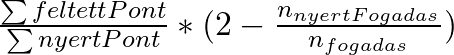
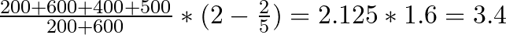

# Szorzó számítás

A program a játékok szorzóit az alábbi képlet szerint számolja:  

## Alap képlet
Először a feltett pontok összegét elosztjuk a nyert pontok összegével. Ez a vesztes fogadók pontjait arányosan elosztja
a nyertes fogadók között. Az alap képlettel számolva a játékban lévő pontok összege állandó (amennyiben volt nyertes fogadás).

## Egyediségi bónusz
A merészebb, változatosabb fogadások ösztönzése érdekében a szorzók egy egyediségi bónuszt is kapnak.
A nyertes fogadások darabszámát elosztjuk az összes fogadás darabszámával. Így egy 0 és 1 közötti számot kapunk, amit
2-ből kivonva megkapjuk a bónuszt. Minél több fogadó adott le fogadást a nyertes értékkel, annál kisebb az egyediségi bónusz.

## Példa
Egy példa alany-esemény párosra 5 darab fogadás érkezett:

- A eset: 200 pont, 600 pont
- B eset: 400 pont
- C eset: 500 pont

Ha az A eset nyert, a szorzót a következő módon számoljuk:  

## Különleges esetek
- Amennyiben egy alany-esemény párosra nem érkezett fogadás, vagy egy fogadó sem nyert, a szorzó értéke 0.
- Ha csak egy fogadás érkezett, vagy minden fogadó nyert, a szorzó értéke 1.