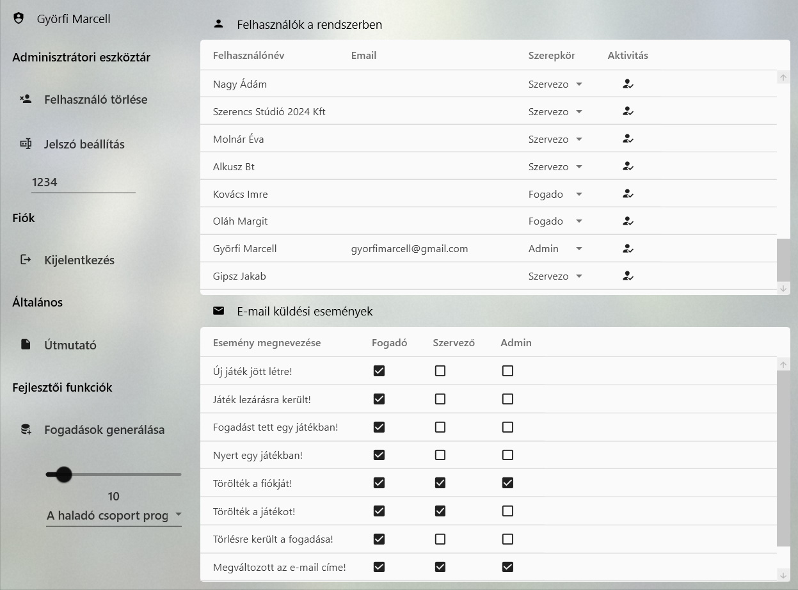
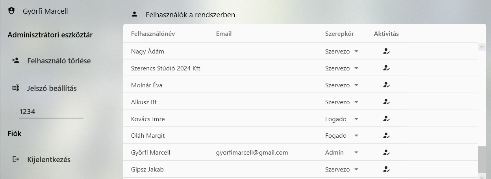
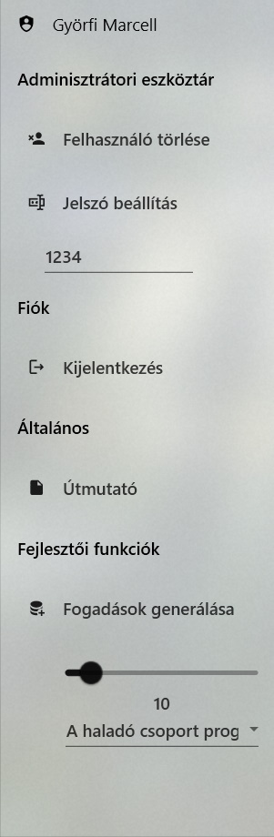
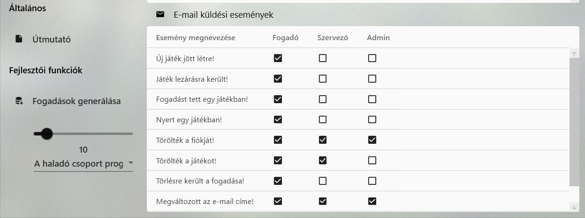

# Adminisztrátoroknak

## <a name="tablazat">Felhasználókat megjelenítő táblázat</a>

Az alábbi táblázatban láthatók a felhasználók adatai:

A táblázat megmutatja a felhasználók:

- **Nevét:** Minden felhasználónak egyedi felhasználóneve van, amit nem lehet változtatni.
- **E-mail címét:** A felhasználók e-mail címét a mezőbe kattintva tudja az adminisztrátor módosítani. Itt nem kell teljesülnie a jelszót illető formai előírásoknak. `!`
- **Szerepkörét:** A felhasználók szerepkörét az adminisztrátor egy legördülő listából tudja változtatni. A listának három eleme van: `Fogado, Szervezo, Admin`.
- **Aktivitását:** Egy felhasználó aktívnak tekintett, ha van beállítva jelszava.

## Menü

A menüben érhetők el az adminisztrátor legfontosabb funkciói:

- **Felhasználó törlése:** A [táblázatból](#tablazat) kiválasztott felhasználókat a gomb megnyomásával tudja törölni az adminisztrátor. A  profiltörlés hosszadalmas folyamat, ami súlyos következményekkel jár. Amennyiben egy szervező törlődik, az összes általa megszervezett játék törlődik, és ha egy fogadó törlődik, akkor az összes fogadása eltávolításra kerül az elmentett adatállományból.
- **Jelszó beállítás:** A kiválasztott felhasználók jelszavát a gomb alatti beviteli mezőben tudja megadni és a gomb megnyomásával véglegesíteni. A felhasználó aktivitása megváltozik, ha az a jelszó beállítás előtt inaktív volt.
`!`

- **Kijelentkezés:** Kijelentkezés és visszatérés a főablakhoz.
- **Útmutató:** A gomb az [Adminisztrátoroknak](admin.md) weboldalra irányít.
- **Fogadások generálás:** A gomb alatt elhelyezett csúszka és legördülő lista segítségével teszt adatként szolgáló fogadásokat lehet generálni. A felhasználó a csúszka segítségével állíthatja be, hogy hány fogadást szeretne generálni, míg a legördülő listáról kiválaszthatja, hogy melyik játékra generálja a program a fogadásokat. `Figyelem: Ez a funkció nincs implementálva minden játékra.`

## <a name="emailBeallitas">E-mail beállítások</a>

Az alábbi táblázatban állíthatja be az adminisztrátor, hogy mikor kapjon e-mail értesítést a [táblázatból](#tablazat) kiválasztott felhasználó:

Az `e-mail küldési események` táblázatban felsorolásra kerülnek az események, és mellettük található négyzetek segítségével lehet kiválasztani, hogy melyik

***
Ezek a funkciók elérhetőek az Admin ablakban, és segítségükkel
hatékonyan kezelhetőek a felhasználók.

