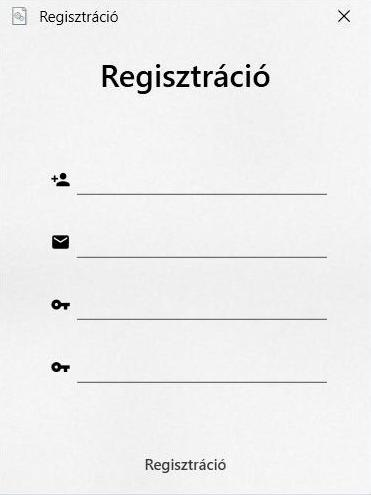
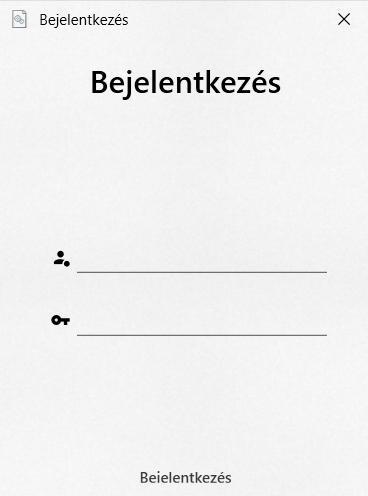
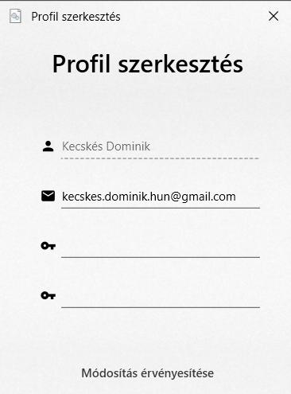

# Fiókkezelés

## Regisztráció

Új felhasználó regisztrálásához a következő adatok szükségesek:

- **Felhasználónév:** Betűkből kell állnia és legalább 3, maximum 15 karakter hosszú. `!`
- **E-mail cím:** Meg kell felelnie az e-mail formátumnak (uj@pelda.hu). `!`
- **Jelszó:** A jelszónak tartalmaznia kell legalább 1 nagy betűt, 1 számot és legalább 8, maximum 15 karakter hosszú. A jelszó újbóli megadásával megbizonyosodhat a felhasználó, hogy nincs elírás a jelszavában. `!`

Sikeres regisztráció után létrejön egy új fogadó profil és a program automatikusan bejelentkezik, megjelenítve a [fogadó](fogado.md) ablakot.

## Bejelentkezés

A megfelelő **jelszó - felhasználónév** párral be tud a felhasználó jelentkezni a profiljába.

Bejelentkezés után a profil szerepkörének megfelelő ablak nyílik meg. [[Fogadó](fogado.md), [Szervező](szervezo.md), [Adminisztrátor](admin.md)]

## Beállítások

A profil szerkesztés ablak lehetőséget nyújt, hogy a felhasználó módosítsa:

- **E-mail címét**
- **Jelszavát**

Ugyanazon feltételek alapján, mint regisztrációnál.

## Importált felhasználók
Ha a `jatekok.txt` vagy a `fogadasok.txt` fájlok ismeretlen felhasználókra hivatkoznak, a program automatikusan regisztrálja 
őket. Ezek az *importált* felhasználók nem rendelkeznek email címmel, és nem jelentkezhetnek be, amíg egy adminisztrátor nem 
állít be egy új jelszót.
