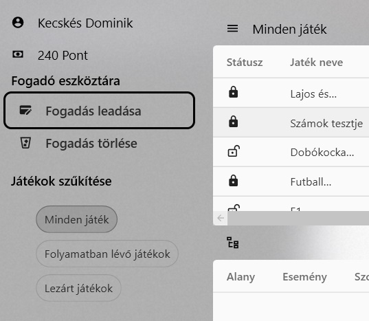
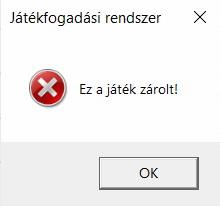
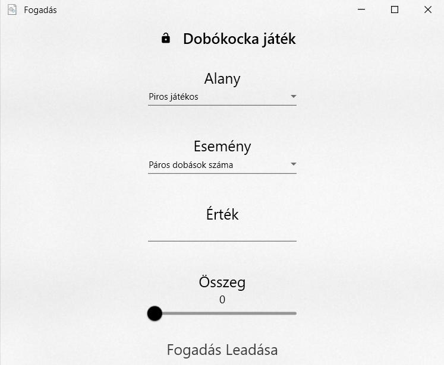
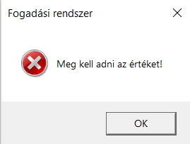
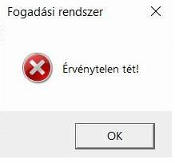
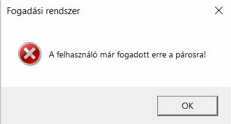
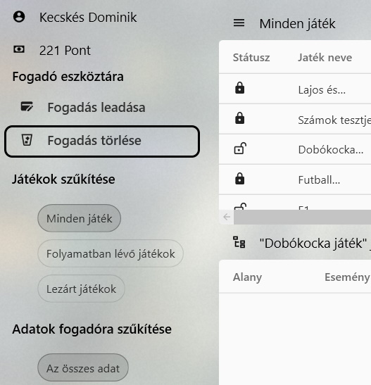
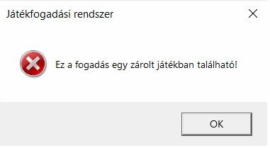

# Fogadóknak

## Fogadás leadása
A fogadást a "Fogadás leadása" gombbal lehet elkezdeni, amint a felhasználó kiválasztott egy nyitott játékot.

Ha a felhasználó megpróbál fogadást leadni egy zárt játékra, a rendszer ezt megakadályozza és egy hibaüzenetet dob vissza, jelezve, hogy a kiválasztott játékra már nem lehet fogadást leadni.

Ha a feltételek teljesültek, egy új ablakot nyit meg az alkalmazás, amiben a felhasználó leadhat egy nem létező fogadási kombinációt. Ha a felhasználó egy már létező fogadási kombinációt állít be, nem ír be értéket vagy nem tesz fel legalább egy pontot összegként, a program a fogadás leadását megállítja és hibaüzenetet dob.

## Fogadás törlése
A program rendelkezik egy olyan funkcióval, amivel a felhasználó egy nyitott játékban a fogadását törölheti, és ezzel visszakapja a fogadott összeget. Ezt a "Fogadás törlése" gombbal lehet megtenni, amint a felhasználó kiválasztja a törölni kívánt fogadását a "Saját fogadásaim" táblázatban.

Ha a felhasználó megpróbál egy lezárt játékon belüli fogadást törölni, a program ezt megállítja és egy hibaüzenetet dob vissza azzal az indokkal, hogy ez a játék már zárolt.

