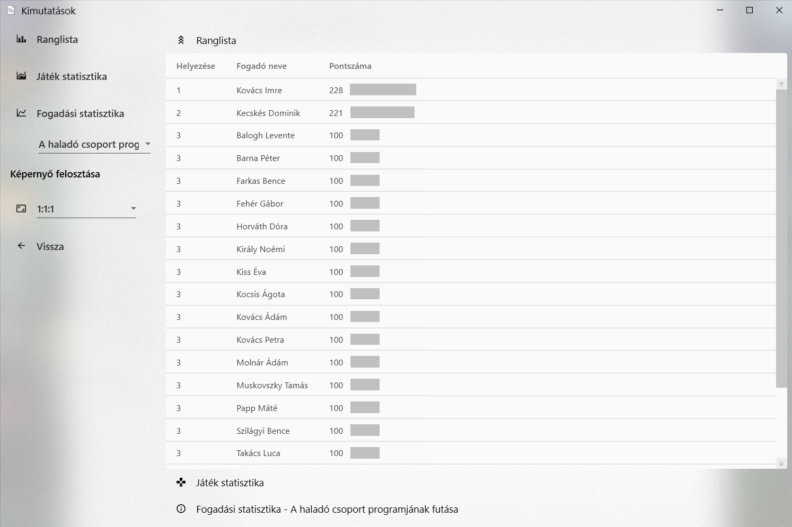
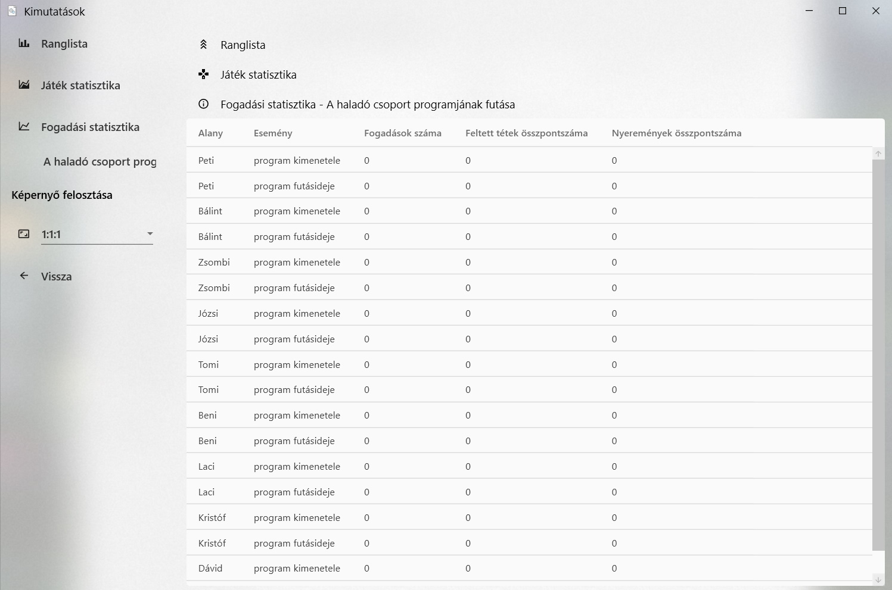

# Kimutatások
## Ranglista
Egy listában megjeleníti a fogadók egészre kerekített pontszámát, és az ez alapján elért helyezésüket. 
Az azonos pontszámúak osztott helyezésben részesülnek. Ha az első két játokosnak azonos a pontszáma, mindketten 
első helyen, míg a harmadik a harmadik helyen végzett.

## Játék statisztika
A program kilistázza az összes játékot, és a hozzájuk tartozó fogadások számát, a feltett tétek összpontszámát, 
a megállapított nyeremények összpontszámát, és a szervezőt.

## Fogadási statisztika
Egy listában megjeleníti a kiválasztott játékban található összes alany és esemény párost, és a hozzájuk tartozó fogadások 
számát, a feltett tétek összpontszámát, és a megállapított nyeremények összpontszámát.

