# Szervezőknek

## Játék létrehozása
Egy új játék létrehozását az "Új játék" gomb segítségével lehet megtenni. A program egy új ablakot fog megnyitni, amiben a játék szükséges beállításai találhatóak.

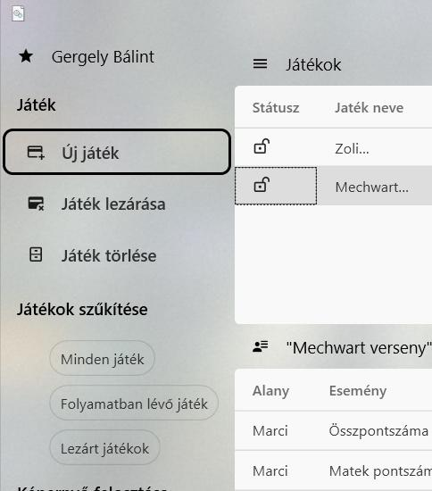

A felhasználónak elsőként meg kell adnia egy eddig nem létező játék nevet, majd a "Játék létrehozása" gombot megnyomva engedélyezi a többi beállítás használatát. Ha a játék neve már létezik, a program hibaüzenetet dob vissza.

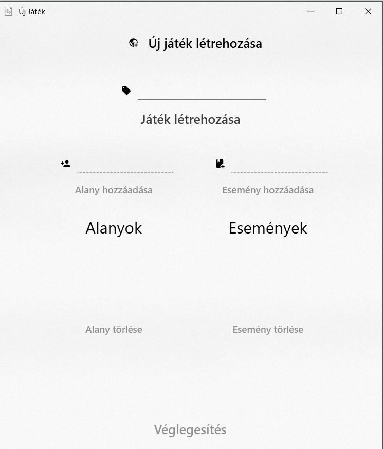

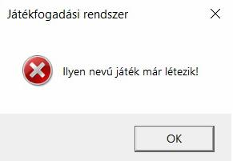

Amint a felhasználó létrehozott egy új játékot, ezután kezdheti meg az alanyok és események felvételét, illetve azok törlését.

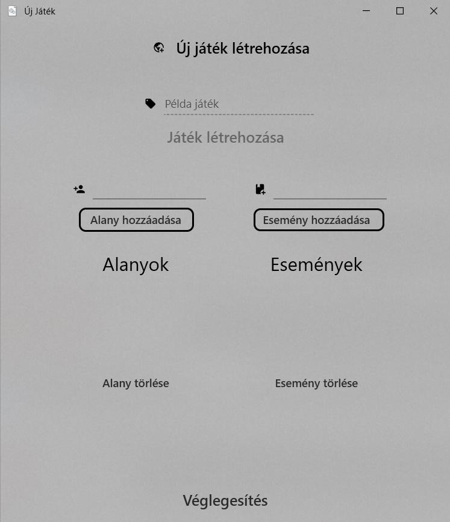

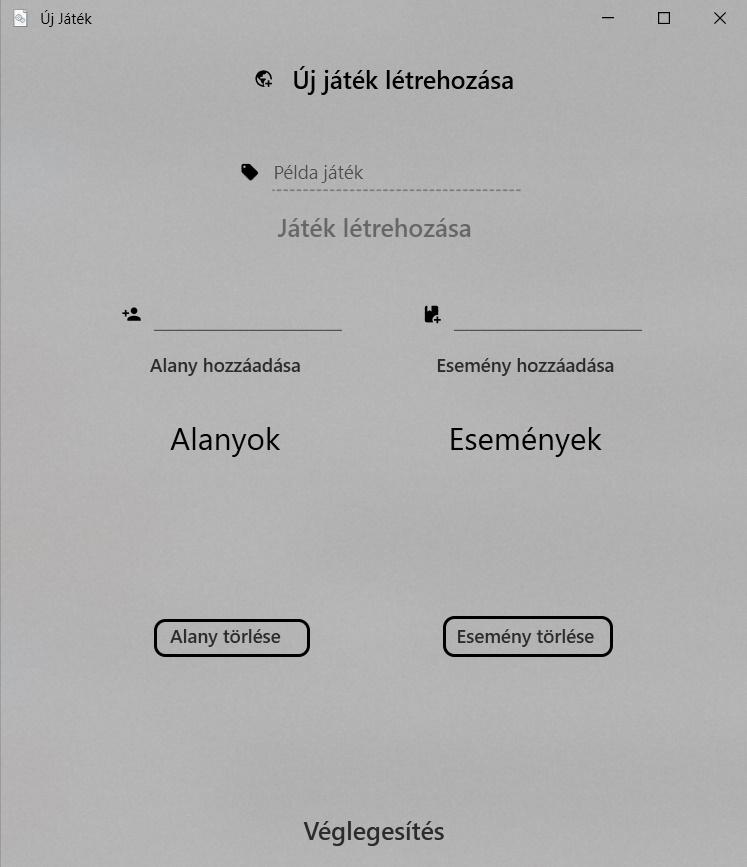

Ha nincs minden mező kitöltve, az alkalmazás hibaüzenetet dob.

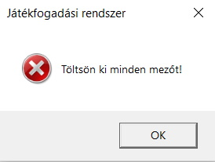

Ha mindennel készen áll, akkor a felhasználó véglegesítheti a játékot, amit később már nem szerkeszthet.

## Játék lezárása
A felhasználó csak egy nyitott állapotú, `saját` játékot képes lezárni. Ha egy lezárt játékkal próbálja ezt megtenni, a program nem fogja ezt engedni és dob egy hibaüzenetet. Ezt a "Játék lezárása" gombbal lehet megtenni, amint a játék ki lett választva.

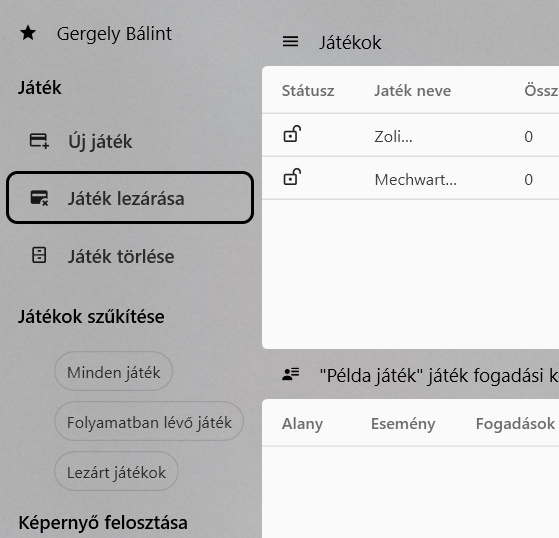

Ha a felhasználó az előző feltételekkel választ egy játékot lezárásra, akkor a rendszer létrehoz egy ablakot, amiben a felhasználó megkapja a játék összes alanyának és eseményének kombinációját. Ekkor a felhasználónak minden egyes mezőbe be kell írnia a megfelelő eredményt az "Eredmény" oszlopban.

A felhasználó a játékot a "Játék lezárása" gombbal teheti meg. Ha nincs minden mező kitöltve, a program nem engedi a játék lezárását.

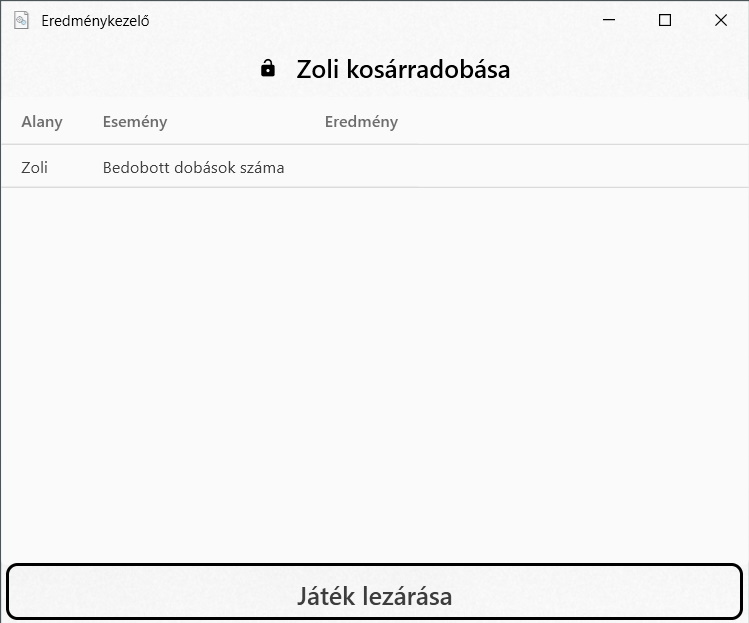

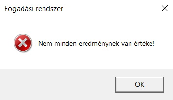

## Játék törlése
A felhasználónak megvan a lehetősége ahhoz is, hogy egy `nyitott` játékot töröljön. Ha a játék zárt, a program nem fogja a játék törlését engedni. Ezt a "Játék törlése" gombbal lehet megtenni.

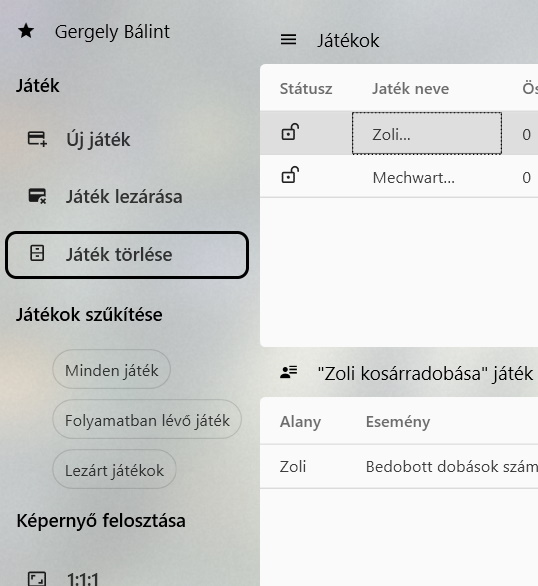

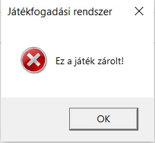

Ha a felhasználó egy nyitott játékot választott, a rendszer megkérdezi, hogy törölni kívánja a játékot, és ha az igenre kattint, akkor a rendszer eltávolítja a játékot.

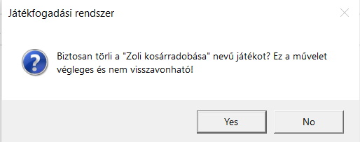